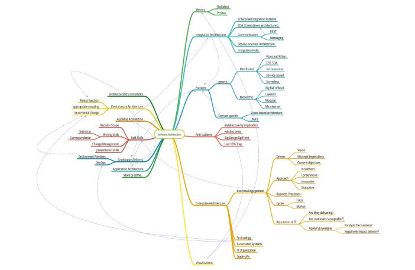


شغل معماری نرم افزار در لیست بهترین مشاغل دنیا در بالای لیست دیده می شود. با این حال وقتی خوانندگان به مشاغل دیگر آورده شده در آن لیست نگاه می کنند (به طور مثال پرستار یا مدیر مالی) یک مسیر شغلی روشن برای آن وجود دارد.چرا راهم شخصی برای شغل معماری نرم افزار وجود ندارد؟

اولا معماری نرم افزار تعریف درستی از خود ارائه نداده است. وقتی کلاس های پایه را تدریس می کنیم،  دانش آموزان خواستار تعریف مختصری از کارهای یک معمار نرم افزار می‌شوند، ما نیز از دادن یک پاسخ قاطعانه خودداری می‌کنیم تنها ما نیستیم که این پاسخ را میدهیم. مارتین فاولر مشهور در جای می‌نویسد "چه کسی به معمار نیاز دارد". یا از رالف جانسون نقل قول می کنیم که میگوید.

"معماری در مورد چیزهای مهم است ... هر چه که باشد"

وقتی فشارها زیاد شد شروع به تهیه یک نقشه ذهنی کردیم که در تصویر ۱ قابل مشاهده است که به طرز تاسف باری ناقص است اما نشان دهنده دامنه فعالیت های معمار نرم افزار می‌باشد. ما در واقع تعریف خودمان را از معمار نرم فزار به زودی ارائه خواهیم داد.

ثانیا همانطور که در نقشه ذهنی می‌بینید، نقش معمار نرم افزار حجم عظیمی از مسئولیت و دامنه مسئولیت را در بر می گیرد که همچنان در حال گسترش است. یک دهه قبل معماران نرم افزار فقط با جنبه های صرفا فنی معماری مانند modularity, components, patterns سروکار داشتند. در حال حاضر به دلیل سبک های جدید معماری که از طیف وسیع تری از قابلیت ها را بهره می‌برند (مثل میکروسرویس‌ها) نقش معمار نرم افزار گسترش یافته است.

شکل 1-1 مسئولیت‌های یک معمار نرم افزار بهمراه توانایی‌های فنی که در بر می‌گیرد، مهارت‌های نرم، آگاهی عملیاتی و انبوهی دیگر ...

ثالثا، معماری نرم افزار به دلیل تکامل سریع اکوسیستم توسعه نرم افزار مدام در حال رشد و تغییر است. هر تعریفی که امروز ارائه می‌شود، چند سال دیگر به طرز ناامیدکننده ای منسوخ می‌گردد. تعریف معماری نرم افزار در ویکی پدیا یک نمای کلی معقول ارائه می دهد اما خیلی از مطالب قدیمی و منسوخ شده هستند، مانند "معماری نرم افزار در مورد ایجاد یا انتخاب ساختاری‌های اساسی است که پس از پیاده سازی تغییر آنها پرهزینه است". با این حال معماران سبک های معماری مدرن مانند میکروسرویس ها را طراحی کردند که تغییر در آن پرهزینه نیست، البته این قابلیت در این معماری باعث نگرانی همچون coupling می‌گردد. خیلی از کتاب معماری نرم افزار آن را به عنوان یک مشکل ثابت در نظر می‌گیرند، که یکی از راه حل‌های آن در نظر نگرفتن و بی‌خطر دانستنش است. به هر حال ما در سراسر این کتاب تعریف معماری نرم افزار را یک ماهیت ذاتا پویا در نظر گرفته ایم.

رابعا، بخش عمده ای از معماری نرم افزار مربوط به تاریخ این حرفه است. وقتی در صفحات ویکی پدیا سیر می‌کنید شما به مجموعه گیج کننده‌ای از کلمات و ارجاعات ناقص در سایر اطلاعات برنمی‌خورید. اما خیلی از این کلمات اختصاری منسوخ یا تعاریف غلطی می‌باشند. راه حل‌های که چند سال پیش کاملا معتبر بوده اکنون غیر قابل استفاده است زیرا مبنا و زمینه تغییر کرده است. تاریخچه معماری نرم افزار مملو از موضوعاتی است که معماران در بازه‌ای در آن خصوص سعی‌های داشته‌اند که ما در این کتاب برای آشنای با گوشه‌ای از این اقدامات ناموق، فقط به بخشی از آن‌ها میپردازیم.

چرا اکنون کتابی در خصوص اصول پایه معماری نرم افزار؟ معماری نرم افزار تنها محدوده از جهان تکنولوژی نیست که به طور مداوم در حال تغییر است. تکنولوژی‌های جدید، تکنیک‌ها، توانایی‌ها و ... نیز به طور دائم در تغییر هستند هر دهه که از عمر هر تکنولوژی می‌گذرد لیست بزرگی از تغییرات در آن به چشم می‌خورد. معماران نرم افزار بایستی در این اکو سیستم دائما در حال تغییر تصمیمات لازم را بگیرند. همه چیز در حال تغییر است حتی اصول پایه‌ای که تصمیم شما بر آن استوار بوده است، معماران بایستی برخی از بدیهیات اصلی را که قبلاً در مورد معماری نرم افزار نوشته شده بود را مجددا بررسی کنند. به عنوان مثال در کتاب معماری نرم افزار Devops در نظر گرفته نشده است زیرا در زمان چاپ کتاب این موضوع مطرح نشده بود.

این را به خاطر داشته باشید وقتی در خصوص معماری مطالعه می‌کنید. مطالب مطرح شده فقط در زمینه مورد بحث قابل فهم هستند. بسیاری از تصمیماتی که معماران گرفتند بر اساس واقعیت‌های محیطی بوده که خودشان پیدا کردند. به عنوان مثال یکی از اهداف اصلی که معماران در قرن 20 ام به دنبال آن بودند استفاده بهینه از منابع مشترک بود، زیرا تمامی زیرساخت‌ها گران و تجاری بود: سیستم عامل‌ها، نرم افزارهای سرور، دیتابیس سرور و غیره. تصور کنید در حال قدم زدن در یک دیتاسنتر در سال 2002 هستید و به عنوان رئیس این بخش به شما گفته میشود "من یه ایده انقلابی و ناب در طراحی و معماری دارم که تمامی سرویس بر روی ماشین آلات ایزوله خود اجرا می شوند با پایگاه داده اختصاصی خود (آنچه را که ما اکنون به عنوان میکروسرویس می شناسیم) پس به این معناست که ما نیاز داریم به حداقل 50 مجوز دیتابیس سرور همچنین 50 مجوز ویندوز سرور و در آخر 30 مجوز نرم افزار سرور" در سال 2002 سعی برای ایجاد معماری شبیه به معماری میکروسرویس به طرز غیرقابل تصوری گران بود. با این حال، با ظهور Open Source در طول سال های میانی  به همراه شیوه‌های مهندسی بروزرسانی و انتشار نرم افزارها توسط Devops ما میتوانیم به پیاده سازی چنین معماری به طور منطقی فکر و دست به عمل بزنیم. خوانندگان باید در نظر داشته باشند که همه معماری‌ها محصول زمینه خود هستند.

**تعریف معماری نرم افزار:**

صنعت به عنوان یک کل برای تعریف دقیق معماری نرم افزار تلاش کرده است. برخی از معماران از معماری نرم افزار به عنوان **طرح اولیه** سیستم یاد می‌کنند، در حالی که برخی دیگر آن را به عنوان **نقشه راه** برای توسعه یک سیستم تعریف می کنند. مسئله این تعریف رایج در درک این مضوع است که طرج اولیه یا نقشه راه شامل چه چیزی است. برای مثال وقتی معمار، معماری را تحلیل می‌کند در واقع چه چیزی تحلیل می‌شود.
